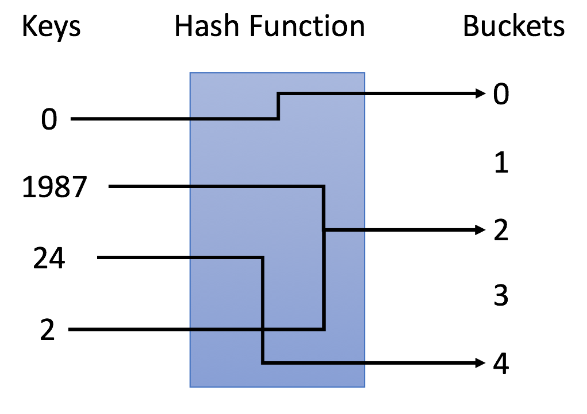

## 第二周学习内容整理

### 1. 哈希表



- 当我们插入新键(new key)时，哈希表会决定分配哪个buckets
- 当我们对键进行搜索时，哈希表会用相同的哈希函数找到对应的bucket并只找寻特定的bucket
  
Python 中哈希表可以直接使用字典来实现：
```
# 1. initialize a hash map
hashmap = {0 : 0, 2 : 3}
# 2. insert a new (key, value) pair or update the value of existed key
hashmap[1] = 1
hashmap[1] = 2
# 3. get the value of a key
print("The value of key 1 is: " + str(hashmap[1]))
# 4. delete a key
del hashmap[2]
# 5. check if a key is in the hash map
if 2 not in hashmap:
    print("Key 2 is not in the hash map.")
# 6. both key and value can have different type in a hash map
hashmap["pi"] = 3.1415
# 7. get the size of the hash map
print("The size of hash map is: " + str(len(hashmap)))
# 8. iterate the hash map
for key in hashmap:
    print("(" + str(key) + "," + str(hashmap[key]) + ")", end=" ")
print("are in the hash map.")
# 9. get all keys in hash map
print(hashmap.keys())
# 10. clear the hash map
hashmap.clear();
print("The size of hash map is: " + str(len(hashmap)))
# 11. 对字典中的value进行排序：
sorted(d.items(), key = lambda x:x[1])
###注： x:x[0]是按照key进行排序
```
例题：2sum：
```
class Solution:
    def twoSum(self, nums: List[int], target: int) -> List[int]:
        dic = {}
        for i, num in enumerate(nums):
            n = target - num
            if n not in dic:
                dic[num] = i
            else:
                return [dic[n], i]
```

## 2. Set
Python 当中set() 函数创建一个无序不重复元素集，可进行关系测试，删除重复数据，还可以计算交集、差集、并集等。
```
# 1. initialize the hash set
hashset = set() 
# 2. add a new key
hashset.add(3)
hashset.add(2)
hashset.add(1)
# 3. remove a key
hashset.remove(2)
# 4. check if the key is in the hash set
if (2 not in hashset):
    print("Key 2 is not in the hash set.")
# 5. get the size of the hash set
print("Size of hashset is:", len(hashset)) 
# 6. iterate the hash set
for x in hashset:
    print(x, end=" ")
print("are in the hash set.")
# 7. clear the hash set
hashset.clear()                         
print("Size of hashset:", len(hashset))
```
例题：Contains Duplicate
```
class Solution(object):
    def containsDuplicate(self, nums):
        """
        :type nums: List[int]
        :rtype: bool
        """
        return len(set(nums)) != len(nums)
```
## 3.树、二叉树、二叉搜索树
Linked List 是特殊化的树，树是特殊化的Graph
- 树的遍历：
  - 前序遍历：前序遍历首先访问根节点，然后遍历左子树，最后遍历右子树。 
  - 中序遍历：中序遍历是先遍历左子树，然后访问根节点，然后遍历右子树。   
  - 后序遍历：后序遍历是先遍历左子树，然后遍历右子树，最后访问树的根节点。 
  - 层序遍历：逐层遍历树结构 
```
def preorder(self, root):
if root:
self.traverse_path.append(root.val)
self.preorder(root.left)
self.preorder(root.right)

def inorder(self, root):
if root:
self.inorder(root.left)
self.traverse_path.append(root.val)
self.inorder(root.right)

def postorder(self, root):
if root:
self.postorder(root.left)
self.postorder(root.right)
self.traverse_path.append(root.val)

```
- 二叉搜索树是指一棵空树或者具有下列性质的二叉树：
  -  左子树上所有结点的值均小于它的根结点的值
  -  右子树上所有结点的值均大于它的根结点的值
- 二叉搜索树的中序遍历是升序排列


- 二叉搜索树主要支持三个操作：搜索、插入和删除。对于每个节点：
  - 如果目标值等于节点的值，则返回节点；
  - 如果目标值小于节点的值，则继续在左子树中搜索；
  - 如果目标值大于节点的值，则继续在右子树中搜索。 
- 二叉搜索树中搜索目标值为 4 的节点：
  

## 4. 堆
堆是可以迅速找到一堆数中的最大或者最小值的数据结构
 - [heapsort](https://www.geeksforgeeks.org/heap-sort/) 
 - Python 当中堆的实现：
```
# Python code to demonstrate working of 
# heapify(), heappush() and heappop() 

# importing "heapq" to implement heap queue 
import heapq 

# initializing list 
li = [5, 7, 9, 1, 3] 

# using heapify to convert list into heap 
heapq.heapify(li) 

# printing created heap 
print ("The created heap is : ",end="") 
print (list(li)) 

# using heappush() to push elements into heap 
# pushes 4 
heapq.heappush(li,4) 

# printing modified heap 
print ("The modified heap after push is : ",end="") 
print (list(li)) 

# using heappop() to pop smallest element 
print ("The popped and smallest element is : ",end="") 
print (heapq.heappop(li)) 

```
 - 用堆来解决最小的k个数：
```
class Solution:
    def getLeastNumbers(self, arr: List[int], k: int) -> List[int]:
        if k == 0:
            return []
        hp = [-x for x in arr[:k]]
        heapq.heapify(hp)
        for i in range(k, len(arr)):
            if -hp[0] > arr[i]:
                heapq.heappop(hp)
                heapq.heappush(hp, -arr[i])
        ans = [-x for x in hp]
        return ans
```
- Python当中，PriorityQueue就是用heapq实现的
```
#向队列中添加元素
Queue.put(item[, block[, timeout]])
#从队列中获取元素
Queue.get([block[, timeout]])
#队列判空
Queue.empty()
#队列大小
Queue.qsize()
```


